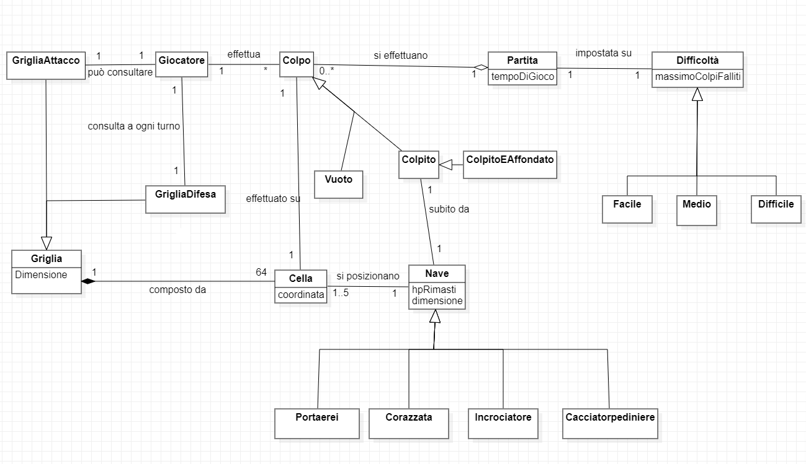
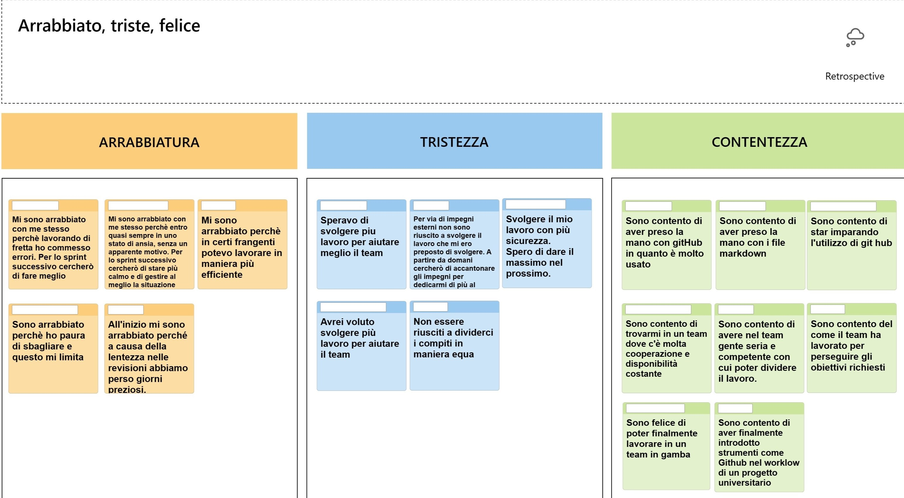
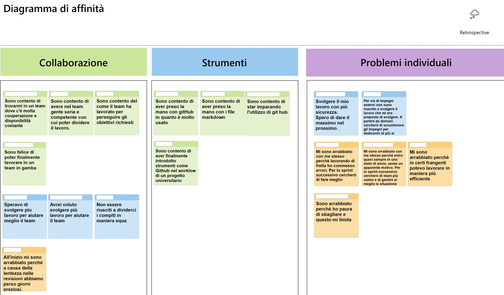
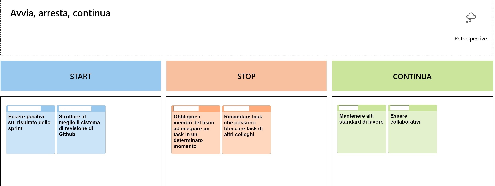

# Report

## Indice

- [Introduzione](#1-introduzione)
- [Modello di Dominio](#2-modello-di-dominio)
- [Requisiti specifici](#3-requisiti-specifici)
  - [Requisiti funzionali](#31-requisiti-funzionali)
  - [Requisiti non funzionali](#32-requisiti-non-funzionali)
- [Manuale Utente](#7-manuale-utente)
- [Analisi retrospettiva](#9-analisi-retrospettiva)
  - [Sprint 0](#91-sprint-0-dimostrare-familiarità-con-github-e-il-processo-agile)

# 1. Introduzione
Nella seguente documentazione verrà descritta la relazione tecnica del progetto di **Ingegneria del Software Anno Accademico 2022-2023**.

Iniziamo con le presentazioni:


## Gruppo Nygaard 

<br>


### **Davide Cirilli**
20 anni, Molfetta (BA) <br>
d.cirilli2@studenti.uniba.it 

<br>


### **Mattia Curri** 
20 anni, Ceglie Messapica (BR) <br>
m.curri8@studenti.uniba.it 

<br>


### **Emanuele Fontana** 
20 anni, Matera (MT) <br>
e.fontana7@studenti.uniba.it 

<br>


### **Stefano Labianca**
20 anni, Corato (BA)  <br>
s.labianca10@studenti.uniba.it

<br>


### **Giuditta Izzo** 
21 anni, Bari (BA)  <br>
g.izzo2@studenti.uniba.it 

---

<br>

Il progetto svolto, consiste nella realizzazione della **Battaglia Navale**, sotto forma di applicazione eseguibile da riga di comando (*CLI*).

In questa realizzazione, il giocatore si scontrerà contro il proprio computer che, ad inizio partita, genererà casualmente le posizioni delle navi. 
Spetterà quindi al giocatore trovarle tutte e affondarle prima di esaurire il numero massimo di tentaviti falliti dati.

Il numero massimo di tentativi falliti consentiti, dipende dalla difficoltà scelta:
* **Facile**: Massimo 50;
* **Medio**: Massimo 30;
* **Difficile**: Massimo 10;

# 2. Modello Di Dominio

*I diagrammi che verranno mostrati, all'interno della relazione, sono stati realizzati
con **StarUML**.* (https://staruml.io/)

<br/>

- ### Diagramma delle Classi con prospettiva concettuale



  <br/>


# 3. Requisiti specifici

## 3.1 Requisiti Funzionali

Di seguito, i ***Requisiti Funzionali*** del progetto, facenti parte della *User Story*.

- ***RF1**: mostrare l'help con elenco comandi e regole del gioco*

  Come giocatore voglio mostrare l'help con elenco comandi.

  **Criteri di accettazione**

  Al comando ```/help```
  o invocando l'app con flag ```--help``` o ```-h```

  Il risultato è una descrizione concisa, che normalmente appare all'avvio del
  programma, seguita da una lista di comandi disponibili,
  uno per riga, come da esempio successivo:

  - gioca
  - esci
  - ...

<br/>

- ***RF2**: chiudere il gioco*

  Come giocatore voglio chiudere il gioco.

  **Criteri di accettazione**
  
  Al comando ```/esci```

    - l'applicazione chiede conferma
        - se la conferma è positiva, l'applicazione si chiude restituendo il controllo al sistema operativo
        - se la conferma è negativa, l'applicazione si predispone a ricevere nuovi tentativi o comandi

<br/>

- ***RF3**: impostare il livello di gioco per variare il numero massimo di tentativi falliti*

  Come giocatore voglio impostare il livello di gioco per variare il numero massimo di tentativi sbagliati.

  **Criteri di accettazione**
  - Al comando ```/facile```

    - l’applicazione risponde con OK e imposta a 50 il numero massimo di tentativi falliti

  - Al comando ```/medio```

    - l’applicazione risponde con OK e imposta a 30 il numero massimo di tentativi falliti

  - Al comando ```/difficile```

    - l’applicazione risponde con OK e imposta a 10 il numero massimo di tentativi falliti

<br/>

- ***RF4**: mostrare i tipi di nave e il numero*

  Come giocatore voglio mostrare i tipi di nave e il numero
  
  **Criteri di accettazione**

  Al comando ```/mostranavi``` l’applicazione risponde visualizzando, per ogni tipo di nave, la dimensione in quadrati e il numero di esemplari da affondare
  
  -    Cacciatorpediniere ⊠⊠ esemplari: 4
  -    Incrociatore ⊠⊠⊠ esemplari: 3 
  -    Corazzata ⊠⊠⊠⊠ esemplari: 2 
  -    Portaerei ⊠⊠⊠⊠⊠ esemplari: 1

<br/>

- ***RF5**: iniziare una nuova partita*

  Come giocatore voglio iniziare una nuova partita

  **Criteri di accettazione**

  Al comando ```/gioca```

    - se nessuna partita è in corso l'applicazione imposta casualmente le navi, in orizzontale o in verticale, mostra la griglia vuota e si predispone a ricevere il primo tentativo o altri comandi

<br/>

- ***RF6**: svelare la griglia con le navi posizionate*

  Come giocatore voglio svelare la griglia con le navi posizionate

  **Criteri di accettazione**

  Al comando ```/svelagriglia```

    - l’applicazione risponde visualizzando, una griglia 10x10, con le righe numerate da 1 a 10 e le colonne numerate da A a J, e tutte le navi posizionate
 
<br/>


- ***RF7**: impostare il numero di tentativi per difficoltà*

  Come giocatore voglio impostare il numero massimo di tentativi falliti per livello di gioco 
  
  **Criteri di accettazione**

  - Al comando ```/facile numero```

    - l’applicazione risponde con OK e imposta a *numero* il numero massimo di tentativi falliti 
  
  - Al comando ```/medio numero```

    - l’applicazione risponde con OK e imposta a *numero* il numero massimo di tentativi falliti 

  - Al comando ```/difficile numero```
  
      - l’applicazione risponde con OK e imposta a *numero* il numero massimo di tentativi falliti 

<br/>

- ***RF8**: impostare direttamente il numero di tentativi*

  Come giocatore voglio impostare direttamente il numero massimo di tentativi che si possono fallire

  **Criteri di accettazione**

  Al comando ```/tentativi numero ```
  
  - l’applicazione risponde con OK e imposta a *numero* il numero massimo di tentativi falliti

<br/>

- ***RF9**: mostrare i tentativi*

  Come giocatore voglio mostrare il numero massimo di tentativi falliti

  **Criteri di accettazione**

  Al comando ```/mostratentativi``` (quando non si è in partita)

  - l’applicazione risponde visualizzando il numero di tentativi già effettuati, il numero di tentativi falliti e il numero massimo di tentativi falliti  

<br/>

- ***RF10**: impostare la dimensione della griglia*

  Come giocatore voglio impostare la taglia della griglia

  **Criteri di accettazione**

  - Al comando ```/standard```

    - l’applicazione risponde con OK e imposta a 10x10 la dimensione della griglia (è il default)

  - Al comando ```/large```

    - l’applicazione risponde con OK e imposta a 18x18 la dimensione della griglia

  - Al comando ```/extralarge```

    - l’applicazione risponde con OK e imposta a 26x26 la dimensione della griglia

<br/>

- ***RF11**: impostare il tempo di gioco*

  Come giocatore voglio impostare il tempo di gioco

  **Criteri di accettazione**

  Al comando ```/tempo numero```

  - l’applicazione risponde con OK e imposta a *numero* il numero di minuti a disposizione per giocare

<br/>

- ***RF12**: mostrare il tempo di gioco*

  Come giocatore voglio mostrare il tempo di gioco

  **Criteri di accettazione**

  Al comando ```/mostratempo```

  - l’applicazione risponde visualizzando il numero di minuti trascorsi nel gioco e il numero di minuti ancora disponibili

<br/>

- ***RF13**: effettuare un colpo*

  Come giocatore voglio effettuare un tentativo per colpire una nave

  **Criteri di accettazione**

  - Digitando una coppia di caratteri separati da un trattino, corrispondenti rispettivamente al numero di riga e alla lettera della colonna, (es. B-4), l’applicazione risponde  

    - “acqua” se sulla cella non è posizionata nessuna nave; 

    - "colpito" se sulla cella è posizionata una nave; 

    - colpito e affondato" se sulla cella è posizionata una nave ed è l’ultima cella non colpita della nave. 
  
  - Qualunque sia l’esito del tentativo, l’applicazione mostra la griglia con le navi colpite parzialmente o affondate, il numero di tentativi già effettuati, e il tempo trascorso.  

  - La partita termina con successo se il tentativo ha affondato l’ultima nave. 

  - La partita termina con insuccesso se è stato raggiunto il numero massimo di tentativi falliti o se è scaduto il tempo di gioco.  

<br/>

- ***RF14**: mostrare la griglia di conoscenza*

  Come giocatore voglio mostrare la griglia con le navi colpite e affondate

  **Criteri di accettazione**

  Al comando ```/mostragriglia```

   - l’applicazione risponde visualizzando, una griglia delle dimensioni impostate, con le navi affondate e le sole parti già colpite delle navi non affondate.

<br/>

- ***RF15**: mostrare i tentativi effettuati*

  Come giocatore voglio mostrare i tentativi effettuati

  **Criteri di accettazione**

  Al comando ```/mostratentativi``` (quando si è in partita)

  - l’applicazione risponde visualizzando il numero di tentativi già effettuati, il numero di tentativi falliti e il numero massimo di tentativi falliti 

<br/>

- ***RF16**: abbandonare la partita*

  Come giocatore voglio abbandonare la partita

  **Criteri di accettazione**

  Al comando ```/abbandona```

  - l'applicazione chiede conferma

    - se la conferma è positiva, l’applicazione risponde visualizzando sulla griglia la posizione di tutte le navi e si predispone a ricevere nuovi comandi

    - se la conferma è negativa, l'applicazione si predispone a ricevere nuovi tentativi o comandi

</br>

## 3.2 Requisiti non Funzionali

Il funzionamento del software richiede:

- **RNF1**: il container docker dell’app deve essere eseguito da terminali che supportano Unicode con encoding UTF-8 o UTF-16.

<br/>

# 7. Manuale utente

## Indice

- [Passi preliminari](#passi-preliminari)
  - [Installazione e configurazione di Docker](#installazione-e-configurazione-di-docker)
  - [Autenticazione con Github](#autenticazione-con-github)
- [Avvio dell'applicazione](#avvio-dellapplicazione)
  - [Comandi in gioco](#comandi-in-gioco)

## Passi preliminari

### Installazione e configurazione di Docker

- Scaricare ed installare **Docker Desktop** dal sito ufficiale (*https://www.docker.com/products/docker-desktop/*)
- Assicurarsi che l'installazione sia andata a buon fine
  - Avviare il programma **con privilegi elevati**
  - Utilizzare un prompt dei comandi e digitare il seguente comando: ``` docker info ```

    Se l'installazione è avvenuta con successo, e Docker viene eseguito correttamente, si avrà un risultato del genere:


### Autenticazione con Github
- Eseguire il login con l'account GitHub in modo tale da poter ottenere l'applicazione
  - Se non si ha a disposizione un *Personal Access Token*, crearne uno seguendo le direttive ufficiali (*https://docs.github.com/en/authentication/keeping-your-account-and-data-secure/creating-a-personal-access-token#creating-a-personal-access-token-classic*)
  - Salvare il token in un file di testo, chiamando il file ad esempio `TOKEN.txt`
  - Portarsi in un prompt dei comandi nella cartella dove è stato salvato il precedente file ed eseguire il seguente comando:
  ```bash
    cat ./TOKEN.txt | docker login ghcr.io -u <USERNAME> --password-stdin
  ```
    sostituendo il vostro username di GitHub alla voce `<USERNAME>`.

## Avvio dell'applicazione

Per poter eseguire il programma ed avviarlo, assicurandosi di avere *Docker Desktop* in esecuzione, eseguire il seguente comando:
```shell
docker pull ghcr.io/softeng2223-inf-uniba/battleship-nygaard:latest
```

Successivamente, per avviare l'applicazione, è possibile eseguire il seguente comando senza argomenti:

```shell
docker run --rm -it ghcr.io/softeng2223-inf-uniba/battleship-nygaard:latest
```

In alternativa, se si vuole avviare l'applicazione con argomenti, è possibile eseguire il seguente comando:

```shell
docker run --rm -it ghcr.io/softeng2223-inf-uniba/battleship-nygaard:latest <ARGOMENTO>
```

sostituendo `<ARGOMENTO>` con gli argomenti che si vogliono passare all'applicazione (ricordiamo che al momento sono ammessi `--help` o la versione compatta `-h`)

**Attenzione!** Eseguire i comandi in un terminale che soddisfa il Requisito non Funzionale riportato nella sezione dedicata.

Se tutto è andato a buon fine, l'applicazione verrà avviata e verrà eseguita la schermata di benvenuto:

- **Esecuzione senza argomenti**


- **Esecuzione con argomenti**


All'avvio dell'applicazione, verrà eseguita la schermata di benvenuto, con la scritta *Inserire un comando:* che viene visualizzata ogni qualvolta si richiede un comando all'utente.

Per avere informazioni su tutti i comandi disponibili nel gioco, utilizzare il comando ***/help*** che mostrerà la lista dei comandi a disposizione seguiti da una breve descrizione del loro funzionamento:


Per iniziare una nuova partita, impostare la difficoltà utilizzando uno dei comandi tra ***/facile***, ***/medio*** o ***/difficile***, ed eseguire il comando ***/gioca***.

### Comandi in gioco

Una volta avviata la partita è possibile visualizzare la griglia con le navi posizionate utilizzando il comando ***/svelagriglia***:


# 9. Analisi retrospettiva

All'interno di questa sezione, verranno riportate le ***analisi retrospettive*** fatte dal **Team**, nel corso del
tempo, ad ogni ***Sprint Feedback***, seguendo questo *schema* strutturato:

- *cosa ci ha soddisfatto*
- *cosa ci ha deluso*
- *cosa abbiamo imparato*

## 9.1 **Sprint 0**: *dimostrare familiarità con GitHub e il processo agile*

Il seguente *diagramma* è relativo agli **stati emotivi** e alle ragioni che li hanno scatenati provati durante l'esecuzione dello Sprint 0:



Il seguente *diagramma*, definito **Diagramma di affinità** raggruppa gli stati d'animo, precedentemente elencati, rispetto ai seguenti ambiti di lavoro:

- *collaborazione*
- *strumenti*
- *problemi individuali*



Infine consideriamo il *diagramma* relativo a ciò che vorremmo **mantenere**, **smettere** o **incomiciare** a fare:



<br/>
