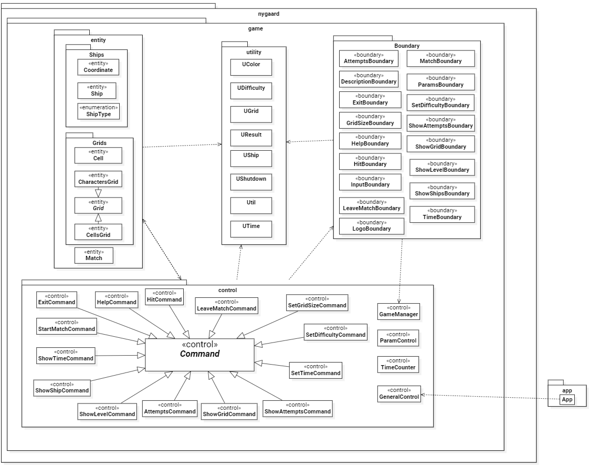
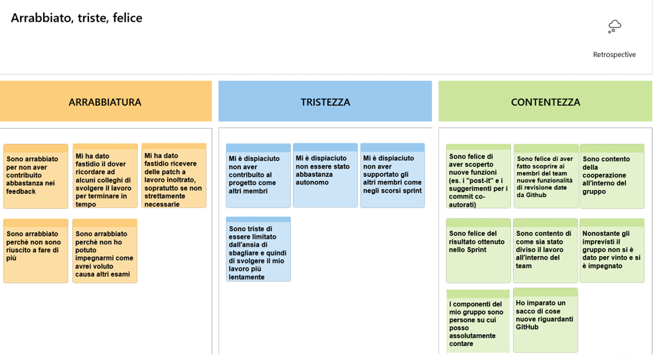

# Report

## Indice

- [Report](#report)
    - [Indice](#indice)
- [1. Introduzione](#1-introduzione)
    - [Gruppo Nygaard](#gruppo-nygaard)
        - [**Davide Cirilli**](#davide-cirilli)
        - [**Mattia Curri** ](#mattia-curri)
        - [**Emanuele Fontana**](#emanuele-fontana)
        - [**Stefano Labianca**](#stefano-labianca)
        - [**Giuditta Izzo**](#giuditta-izzo)
- [2. Modello Di Dominio](#2-modello-di-dominio)
- [3. Requisiti specifici](#3-requisiti-specifici)
    - [3.1 Requisiti Funzionali](#31-requisiti-funzionali)
    - [3.2 Requisiti non Funzionali](#32-requisiti-non-funzionali)
- [4. System Design](#4-system-design)
    - [4.1 Diagramma dei package](#41-diagramma-dei-package)
    - [4.2 Commento sulle decisioni prese](#42-commento-decisioni-prese)
- [6. Riepilogo del Testing](#6-riepilogo-del-test)
    - [6.1 Strumenti di analisi/testing del codice utilizzati](#61-strumenti-di-analisitesting-del-codice-utilizzati)
    - [6.2 Presentazione esiti test e considerazioni](#62-presentazione-esiti-test-e-considerazioni)
    - [6.3 Descrizione dei test effettuati](#63-descrizione-dei-test-effettuati)
- [7. Manuale utente](#7-manuale-utente)
    - [Indice](#indice-1)
    - [Passi preliminari](#passi-preliminari)
        - [Installazione e configurazione di Docker](#installazione-e-configurazione-di-docker)
        - [Autenticazione con Github](#autenticazione-con-github)
    - [Avvio dell'applicazione](#avvio-dellapplicazione)
        - [Comandi in gioco](#comandi-in-gioco)
- [8. Processo di sviluppo e organizzazione del lavoro](#8-processo-di-sviluppo-e-organizzazione-del-lavoro)
    - [8.1 Introduzione al processo di sviluppo](#81-introduzione-al-processo-di-sviluppo)
    - [8.2 Roadmap degli sprint](#82-roadmap-degli-sprint)
    - [8.3 Gestione degli Sprint](#83-gestione-degli-sprint)
        - [Sprint 0](#sprint-0)
        - [Sprint 1](#sprint-1)
        - [Sprint 2](#sprint-2)
    - [8.4 Software utilizzati](#84-software-utilizzati)
    - [8.5 Comunicazione interna al team](#85-comunicazione-interna-al-team)
- [9. Analisi retrospettiva](#9-analisi-retrospettiva)
    - [**Sprint 0**](#91-sprint-0-dimostrare-familiarità-con-github-e-il-processo-agile)
    - [**Sprint 1**](#92-sprint-1-preparare-il-gioco)

# 1. Introduzione

Nella seguente documentazione verrà descritta la relazione tecnica del progetto d'**Ingegneria del Software Anno
Accademico 2022-2023**.

Iniziamo con le presentazioni:

## Gruppo Nygaard

<br>


### **Davide Cirilli**

20 anni, Molfetta (BA) <br>
d.cirilli2@studenti.uniba.it

<br>


### **Mattia Curri**

20 anni, Ceglie Messapica (BR) <br>
m.curri8@studenti.uniba.it

<br>


### **Emanuele Fontana**

20 anni, Matera (MT) <br>
e.fontana7@studenti.uniba.it

<br>


### **Stefano Labianca**

20 anni, Corato (BA)  <br>
s.labianca10@studenti.uniba.it

<br>


### **Giuditta Izzo**

21 anni, Bari (BA)  <br>
g.izzo2@studenti.uniba.it

---

<br>

Il progetto svolto, consiste nella realizzazione della **Battaglia Navale**, sotto forma di applicazione eseguibile da
riga di comando (*CLI*).

In questa realizzazione, il giocatore si scontrerà contro il proprio computer che, a inizio partita, genererà
casualmente le posizioni delle navi.
Spetterà quindi al giocatore trovarle tutte e affondarle prima di esaurire il numero massimo di tentativi falliti dati.

Il numero massimo di tentativi falliti consentiti all'avvio dell'applicazione presenta i seguenti valori, in base alla
difficoltà:

* **Facile**: Massimo 50;
* **Medio**: Massimo 30;
* **Difficile**: Massimo 10;

La difficoltà di default è **Medio**. Sarà comunque possibile personalizzare il numero di tentativi utilizzando gli
appositi comandi.

All'avvio dell'applicazione di default verrà usata una griglia 10x10 ma sarà possibile in seguito selezionare altre
opzioni di griglia attraverso specifici comandi.

# 2. Modello Di Dominio

*I diagrammi che verranno mostrati, all'interno della relazione, sono stati realizzati
con **StarUML**.* (https://staruml.io/)

<br/>

- ### Diagramma delle Classi con prospettiva concettuale


  <br/>

# 3. Requisiti specifici

## 3.1 Requisiti Funzionali

Di seguito, i ***Requisiti Funzionali*** del progetto, facenti parte della *User Story*.

- *[**RF1**](https://github.com/softeng2223-inf-uniba/progetto2223-nygaard/issues/25): mostrare l'help con elenco
  comandi e regole del gioco*

  Come giocatore voglio mostrare l'help con elenco comandi.

  **Criteri di accettazione**

  Al comando ```/help```
  o invocando l'app con flag ```--help``` o ```-h```

  Il risultato è una descrizione concisa, che normalmente appare all'avvio del
  programma, seguita da una lista di comandi disponibili,
  uno per riga, come da esempio successivo:

    - gioca
    - esci
    - ...

<br/>

- *[**RF2**](https://github.com/softeng2223-inf-uniba/progetto2223-nygaard/issues/26): chiudere il gioco*

  Come giocatore voglio chiudere il gioco.

  **Criteri di accettazione**

  Al comando ```/esci```

    - l'applicazione chiede conferma
        - se la conferma è positiva, l'applicazione si chiude restituendo il controllo al sistema operativo
        - se la conferma è negativa, l'applicazione si predispone a ricevere nuovi tentativi o comandi

<br/>

- *[**RF3**](https://github.com/softeng2223-inf-uniba/progetto2223-nygaard/issues/27): impostare il livello di gioco per
  variare il numero massimo di tentativi falliti*

  Come giocatore voglio impostare il livello di gioco per variare il numero massimo di tentativi sbagliati.

  **Criteri di accettazione**
    - Al comando ```/facile```

        - l’applicazione risponde con OK e imposta a 50 il numero massimo di tentativi falliti

    - Al comando ```/medio```

        - l’applicazione risponde con OK e imposta a 30 il numero massimo di tentativi falliti

    - Al comando ```/difficile```

        - l’applicazione risponde con OK e imposta a 10 il numero massimo di tentativi falliti

<br/>

- *[**RF4**](https://github.com/softeng2223-inf-uniba/progetto2223-nygaard/issues/29): mostrare i tipi di nave e il
  numero*

  Come giocatore voglio mostrare i tipi di nave e il numero

  **Criteri di accettazione**

  Al comando ```/mostranavi``` l’applicazione risponde visualizzando, per ogni tipo di nave, la dimensione in quadrati e
  il numero di esemplari da affondare

    - Cacciatorpediniere ⊠⊠ esemplari: 4
    - Incrociatore ⊠⊠⊠ esemplari: 3
    - Corazzata ⊠⊠⊠⊠ esemplari: 2
    - Portaerei ⊠⊠⊠⊠⊠ esemplari: 1

<br/>

- *[**RF5**](https://github.com/softeng2223-inf-uniba/progetto2223-nygaard/issues/30): iniziare una nuova partita*

  Come giocatore voglio iniziare una nuova partita

  **Criteri di accettazione**

  Al comando ```/gioca```

    - se nessuna partita è in corso l'applicazione imposta casualmente le navi, in orizzontale o in verticale, mostra la
      griglia vuota e si predispone a ricevere il primo tentativo o altri comandi

<br/>

- *[**RF6**](https://github.com/softeng2223-inf-uniba/progetto2223-nygaard/issues/31): svelare la griglia con le navi
  posizionate*

  Come giocatore voglio svelare la griglia con le navi posizionate

  **Criteri di accettazione**

  Al comando ```/svelagriglia```

    - l’applicazione risponde visualizzando, una griglia 10x10, con le righe numerate da 1 a 10 e le colonne numerate da
      A a J, e tutte le navi posizionate

<br/>

- *[**RF7**](https://github.com/softeng2223-inf-uniba/progetto2223-nygaard/issues/85): impostare il numero di tentativi
  per difficoltà*

  Come giocatore voglio impostare il numero massimo di tentativi falliti per livello di gioco

  **Criteri di accettazione**

    - Al comando ```/facile numero```

        - l’applicazione risponde con OK e imposta a *numero* il numero massimo di tentativi falliti

    - Al comando ```/medio numero```

        - l’applicazione risponde con OK e imposta a *numero* il numero massimo di tentativi falliti

    - Al comando ```/difficile numero```

        - l’applicazione risponde con OK e imposta a *numero* il numero massimo di tentativi falliti

<br/>

- *[**RF8**](https://github.com/softeng2223-inf-uniba/progetto2223-nygaard/issues/87): impostare direttamente il numero
  di tentativi*

  Come giocatore voglio impostare direttamente il numero massimo di tentativi che si possono fallire

  **Criteri di accettazione**

  Al comando ```/tentativi numero ```

    - l’applicazione risponde con OK e imposta a *numero* il numero massimo di tentativi falliti

<br/>

- *[**RF9**](https://github.com/softeng2223-inf-uniba/progetto2223-nygaard/issues/92): mostrare i tentativi*

  Come giocatore voglio mostrare il numero massimo di tentativi falliti

  **Criteri di accettazione**

  Al comando ```/mostratentativi``` (quando non si è in partita)

    - l’applicazione risponde visualizzando il numero massimo di tentativi falliti

<br/>

- *[**RF10**](https://github.com/softeng2223-inf-uniba/progetto2223-nygaard/issues/83): impostare la dimensione della
  griglia*

  Come giocatore voglio impostare la taglia della griglia

  **Criteri di accettazione**

    - Al comando ```/standard```

        - l’applicazione risponde con OK e imposta a 10x10 la dimensione della griglia (è il default)

    - Al comando ```/large```

        - l’applicazione risponde con OK e imposta a 18x18 la dimensione della griglia

    - Al comando ```/extralarge```

        - l’applicazione risponde con OK e imposta a 26x26 la dimensione della griglia

<br/>

- *[**RF11**](https://github.com/softeng2223-inf-uniba/progetto2223-nygaard/issues/80): impostare il tempo di gioco*

  Come giocatore voglio impostare il tempo di gioco

  **Criteri di accettazione**

  Al comando ```/tempo numero```

    - l’applicazione risponde con OK e imposta a *numero* il numero di minuti a disposizione per giocare

<br/>

- *[**RF12**](https://github.com/softeng2223-inf-uniba/progetto2223-nygaard/issues/81): mostrare il tempo di gioco*

  Come giocatore voglio mostrare il tempo di gioco

  **Criteri di accettazione**

  Al comando ```/mostratempo```

    - l’applicazione risponde visualizzando il numero di minuti trascorsi nel gioco e il numero di minuti ancora
      disponibili

<br/>

- *[**RF13**](https://github.com/softeng2223-inf-uniba/progetto2223-nygaard/issues/82): effettuare un colpo*

  Come giocatore voglio effettuare un tentativo per colpire una nave

  **Criteri di accettazione**

    - Digitando una coppia di caratteri separati da un trattino, corrispondenti rispettivamente al numero di riga e alla
      lettera della colonna, (es. B-4), l’applicazione risponde

        - “acqua” se sulla cella non è posizionata nessuna nave;

        - "colpito" se sulla cella è posizionata una nave;

        - "colpito e affondato" se sulla cella è posizionata una nave ed è l’ultima cella non colpita della nave.

    - Qualunque sia l’esito del tentativo, l’applicazione mostra la griglia con le navi colpite parzialmente o
      affondate, il numero di tentativi già effettuati, e il tempo trascorso.

    - La partita termina con successo se il tentativo ha affondato l’ultima nave.

    - La partita termina con insuccesso se è stato raggiunto il numero massimo di tentativi falliti o se è scaduto il
      tempo di gioco.

<br/>

- *[**RF14**](https://github.com/softeng2223-inf-uniba/progetto2223-nygaard/issues/93): mostrare la griglia di
  conoscenza*

  Come giocatore voglio mostrare la griglia con le navi colpite e affondate

  **Criteri di accettazione**

  Al comando ```/mostragriglia```

    - l’applicazione risponde visualizzando, una griglia delle dimensioni impostate, con le navi affondate e le sole
      parti già colpite delle navi non affondate.

<br/>

- *[**RF15**](https://github.com/softeng2223-inf-uniba/progetto2223-nygaard/issues/79): mostrare i tentativi effettuati*

  Come giocatore voglio mostrare i tentativi effettuati

  **Criteri di accettazione**

  Al comando ```/mostratentativi``` (quando si è in partita)

    - l’applicazione risponde visualizzando il numero di tentativi già effettuati, il numero di tentativi falliti e il
      numero massimo di tentativi falliti

<br/>

- *[**RF16**](https://github.com/softeng2223-inf-uniba/progetto2223-nygaard/issues/88): abbandonare la partita*

  Come giocatore voglio abbandonare la partita

  **Criteri di accettazione**

  Al comando ```/abbandona```

    - l'applicazione chiede conferma

        - se la conferma è positiva, l’applicazione risponde visualizzando sulla griglia la posizione di tutte le navi e
          si predispone a ricevere nuovi comandi

        - se la conferma è negativa, l'applicazione si predispone a ricevere nuovi tentativi o comandi

<br/>

- *[**RF17**](https://github.com/softeng2223-inf-uniba/progetto2223-nygaard/issues/28): mostrare il livello attuale*

  Come giocatore voglio mostrare il livello di gioco e il numero massimo di tentativi falliti

  **Criteri di accettazione**

  Al comando ```/mostralivello```

    - l’applicazione risponde visualizzando il livello di gioco e il numero massimo di tentativi falliti

<br/>

## 3.2 Requisiti non Funzionali

Il funzionamento del software richiede:

- ***RNF1***: il container docker dell’app deve essere eseguito da terminali che supportano Unicode con encoding UTF-8 o
  UTF-16.

<br/>

# 4. System Design

## 4.1 Diagramma dei package



## 4.2 Commento sulle decisioni prese

La suddivisione in package è stata effettuata accomunando le classi in base alle loro responsabilità e compiti svolti. 
In particolare è stato utilizzato il pattern architetturale dell'[*Entity Control Boundary*](https://en.wikipedia.org/wiki/Entity-control-boundary) 
(ECB) che prevede la classificazione delle classi in tre categorie:
 - **CONTROL**: sono le classi che si occupano della logica del software. In particolare si occupano di gestire le interazioni tra le entità e di gestire le richieste dell'utente.

 - **BOUNDARY**: contiene le classi che si occupano dell'interfaccia con l'utente. In particolare si occupano di ricevere i comandi dell'utente e di mostrare i risultati delle operazioni.

 - **ENTITY**: contiene le classi che rappresentano le entità del dominio del problema. In particolare si occupano di rappresentare le entità del gioco e di gestire le loro interazioni.

 Un'altro patter architetturale utilizzato è stato quella del [*Singleton*](https://it.wikipedia.org/wiki/Singleton_(informatica)) che prevede la creazione di una classe che può essere istanziata una sola volta e che fornisce un punto di accesso globale a tale istanza. Questo pattern è stato utilizzato per le classi di tipo Control e per la classe Match (in quanto è possibile giocare solo una partita per volta)

Passiamo ora all'elenco dei package e delle classi in essi contenuti:

- Il package *app* dove è contenuta la classe App che si occupa dell'inizializzazione e avvio del software.
  Questo package è stato definito dal Product Owner.

- Il package *nygaard* contiene tutti i package e le classi create dal team di sviluppo. In particolare abbiamo il package *game* dedicato al gioco nel quale troviamo i seguenti package:
  - entity
  - control
  - boundary
  - utility

- Il package *entity* dove sono contenuti:

  - Match che rappresenta la partita in corso. Contiene tutte le informazioni necessarie per gestire la partita e le classi che la compongono.

  - package *ships* che contiene:

    - Coordinate: classe che rappresenta le coordinate di una cella della griglia di gioco
    - Ship: classe che rappresenta una nave. Contiene tutte le informazioni sulla singola nave
    - ShipType: enumeratore che contiene i tipi di navi presenti nel gioco

  - package *Grids* che contiene:

    - Grid: classe astratta che rappresenta una generica griglia
    - Cell: classe che rappresenta una cella della griglia di gioco. Contiene tutte le informazioni sulla singola cella. In particolare contiene un riferimento alla nave che occupa la cella (se presente)
    - CharactersGrid: classe che rappresenta la griglia di conoscenza del giocatore. Essa mostra le informazioni che il giocatore ha sulla griglia di gioco dell'avversario
    - CellsGrid: classe che rappresenta la griglia di gioco. Essa è una griglia formata da Cell

  Questo package contiene dunque tutte le classi di tipo **Entity** previste dallo standard ECB.

- Il package *control* dove sono contenuti:

  - Command è la classe astratta da cui derivano tutte le classi dei comandi. Di essi ne definisce il metodo principale `executeCommand()` e alcune caratteristiche comuni (come il numero dei parametri minimi e massimi).

  - I vari comandi corrispondendi ai [*requisiti funzionali*](#31-requisiti-funzionali)

  - GeneralControl si occupa di gestire la logica principale del gioco: inizializzazione, avvio, gestione dei comandi e chiusura.

  - GameManager si occupa della gestione della partita. In particolare permette alle varie classi di comunicare con la partita in corso.

  - TimeCounter si occupa della gestione del tempo di gioco.

  - ParamControl si occupa della gestione dei parametri all'avvio dell'applicazione.

  Questo package contiene dunque tutte le classi di tipo **Control** previste dallo standard ECB.

- Il package *boundary* dove sono contenuti:

   - Le varie boundary per gestire gli output dei [*requisiti funzionali*](#31-requisiti-funzionali)

   - InputBoundary che si occupa di gestire l'input dell'utente

   - LogoBoundary che si occupa di mostrare il logo del gioco

   - ParamsBoundary che si occupa della gestione delle stampe a video dipendenti dai parametri dei comandi/avvio applicazione

   - DescriptionBoundary che si occupa di mostrare la descrizione del gioco

  Questo package contiene dunque tutte le classi di tipo **Boundary** previste dallo standard ECB.

- Il package *utility* contiene tutte le classi contenenti le costanti di utilità.

# 6. Riepilogo del Test

## 6.1 Strumenti di analisi/testing del codice utilizzati

- [JUnit 5](https://junit.org/junit5/)

- [Checkstyle](https://checkstyle.sourceforge.io/)

- [Spotbugs](https://spotbugs.github.io/)

- [PMD](https://pmd.github.io/)

## 6.2 Presentazione esiti test e considerazioni

Nello Sprint 2, il gruppo "Nygaard" si è adoperato per effettuare l'attività di Verification&Validation (V&V) che si
suddivide in un processo statico (finalizzato all'analisi del codice con Checkstyle, Spotbugs e PMD) e un processo
dinamico (finalizzato alla creazione di casi di test con JUnit 5 e verifica del funzionamento dei metodi).

Di seguito vengono presentati gli esiti delle fasi di test.

- **Esito test JUnit5**<br/>
  Sono stati implementati un totale di **164** casi di test di cui alcuni sono ripetuti più volte (con parametri od
  oggetti diversi) arrivando così a un totale di **218** casi di test.


- **Esito CheckStyle: Main**


- **Esito CheckStyle: Test**


- **Esito SpotBugs: Main**


- **Esito SpotBugs: Test**


- **Esito PMD: Main**


- **Esito PMD: Test**


- **Esito Build (GitHub Actions)**


## 6.3 Descrizione dei test effettuati

Seguendo l'organizzazione canonica della test suite è stata redatta una classe di test per ogni classe del software a
eccezione delle classi Boundary, in quanto è stato applicato il principio di presentazione separata, e Utility, in
quanto non presentano metodi da testare.
Tutte le classi di test sono state raggruppate in un unico package denominato "test" separato dal resto del codice e la
struttura delle classi nel package test rispecchia la struttura delle classi nel package main.
Inoltre tutti i metodi di test hanno la stringa "test" come prefisso in testa al nome del metodo.

I test sono stati effettuati utilizzando dei criteri **black-box** (o funzionali), ovvero selezionando i casi di test
esclusivamente a partire dalle specifiche e senza conoscere la struttura interna del software.
I criteri adottati sono:

- **Suddivisione in classi di equivalenza**: i casi di test sono stati selezionati in modo da coprire tutti i possibili
  casi d'input, raggruppando i valori in classi di equivalenza.
- **State-based testing**: i casi di test sono stati selezionati in modo da coprire tutti i possibili stati in cui può
  trovarsi il sistema (prima e dopo l'esecuzione del test).

Alcuni test sono stati ripetuti più volte con parametri od oggetti diversi, in modo da coprire tutti i casi possibili
oppure essere sicuri statisticamente di aver testato anche la natura intrinsecamente randomica di alcuni metodi (es.
initializeShips).

Come criterio di terminazione del testing è stato adottato il criterio di copertura delle classi di equivalenza, ovvero
si è deciso di terminare il testing quando tutti i casi di test relativi a tutte le classi di equivalenza sono stati
eseguiti.

***N.B.*** A causa della natura di alcuni metodi di libreria (es. Scanner) alcuni metodi lanciano eccezioni indesiderate
quando vengono testati senza seguire il flusso naturale del programma.
Per questo motivo all'interno dei metodi di test suddette eccezioni sono state catturate, reportate e successivamente
ignorate in quanto non rilevanti ai fini del testing.

# 7. Manuale utente

### Indice

- [Passi preliminari](#passi-preliminari)
    - [Installazione e configurazione di Docker](#installazione-e-configurazione-di-docker)
    - [Autenticazione con Github](#autenticazione-con-github)
- [Avvio dell'applicazione](#avvio-dellapplicazione)
    - [Preparazione della partita](#preparazione-della-partita)
    - [Comandi in gioco](#comandi-in-gioco)
        - [Colpire una cella](#colpire-una-cella)
        - [Visualizzare la griglia d'attacco](#visualizzare-la-griglia-di-attacco)
        - [Visualizzare il numero di tentativi effettuati](#visualizzare-il-numero-di-tentativi-effettuati)
        - [Visualizzare il tempo rimanente](#visualizzare-il-tempo-rimanente)
        - [Visualizzare la griglia con le navi posizionate](#visualizzare-la-griglia-con-le-navi-posizionate)

## Passi preliminari

### Installazione e configurazione di Docker

- Scaricare e installare **Docker Desktop** dal sito ufficiale (*https://www.docker.com/products/docker-desktop/*)
- Assicurarsi che l'installazione sia andata a buon fine
    - Avviare il programma **con privilegi elevati**
    - Utilizzare un prompt dei comandi e digitare il seguente comando: ``` docker info ```

      Se l'installazione è avvenuta con successo, e Docker viene eseguito correttamente, si avrà un risultato del
      genere:
      

### Autenticazione con Github

- Eseguire il login con l'account GitHub in modo tale da poter ottenere l'applicazione
    - Se non si ha a disposizione un *Personal Access Token*, crearne uno seguendo le direttive ufficiali (
      *https://docs.github.com/en/authentication/keeping-your-account-and-data-secure/creating-a-personal-access-token#creating-a-personal-access-token-classic*)
    - Salvare il token in un file di testo, chiamando il file ad esempio `TOKEN.txt`
    - Portarsi in un prompt dei comandi nella cartella dove è stato salvato il precedente file ed eseguire il seguente
      comando:
  ```bash
    cat ./TOKEN.txt | docker login ghcr.io -u <USERNAME> --password-stdin
  ```
  sostituendo il vostro username di GitHub alla voce `<USERNAME>`.

## Avvio dell'applicazione

Per poter eseguire il programma e avviarlo, assicurandosi di avere *Docker Desktop* in esecuzione, eseguire il seguente
comando:

```shell
docker pull ghcr.io/softeng2223-inf-uniba/battleship-nygaard:latest
```

Successivamente, per avviare l'applicazione, è possibile eseguire il seguente comando senza argomenti:

```shell
docker run --rm -it ghcr.io/softeng2223-inf-uniba/battleship-nygaard:latest
```

In alternativa, se si vuole avviare l'applicazione con argomenti, è possibile eseguire il seguente comando:

```shell
docker run --rm -it ghcr.io/softeng2223-inf-uniba/battleship-nygaard:latest <ARGOMENTO>
```

sostituendo `<ARGOMENTO>` con gli argomenti che si vogliono passare all'applicazione (ricordiamo che al momento sono
ammessi `--help` o la versione compatta `-h`)

**Attenzione!** Eseguire i comandi in un terminale che soddisfa i
[**requisiti non funzionali**](#32-requisiti-non-funzionali).

Se tutto è andato a buon fine, l'applicazione verrà avviata e verrà eseguita la schermata di benvenuto:

- **Esempio di esecuzione senza argomenti**
  

All'avvio dell'applicazione, verrà eseguita la schermata di benvenuto, con la scritta ***Inserire un comando:*** che
viene visualizzata ogni qualvolta si richiede un comando all'utente.

Per avere informazioni su tutti i comandi disponibili nel gioco è possibile avviare l'applicazione con i flag
***--help*** o ***-h***, oppure utilizzare il comando ***/help*** ad applicazione avviata. In entrambi i casi verrà
mostrata la lista dei comandi a disposizione seguiti da una breve descrizione del loro funzionamento:


### Preparazione della partita

Le caratteristiche principali di una partita sono modulari: l'utente ha la possibilità di modificare le seguenti
caratteristiche della partita che giocherà:

- Dimensione della griglia su cui saranno posizionate le navi con i comandi ***/standard*** (griglia 10x10),
  ***/large*** (griglia 18x18), ***/extralarge*** (griglia 26x26)
    - Di default la griglia è 10x10
- Numero di tentativi di una specifica difficoltà con i comandi ***/facile*** *numero*, ***/medio*** *numero*,
  ***/difficile*** *numero*
    - L'utilizzo di questi comandi **NON** cambia la difficoltà per la prossima partita ma solo il numero di tentativi,
      per farlo utilizzare ***/facile***, ***/medio*** e ***/difficile*** senza argomenti.
    - Di default il numero di tentativi è 50 per la difficoltà facile, 30 per la difficoltà media, 10 per la difficoltà
      difficile
- Numero di tentativi indipendenti dalla difficoltà (**Attenzione**: questo comando sovrascrive il numero di tentativi
  di **tutte** le difficoltà) col comando ***/tentativi*** *numero*
- Tempo a disposizione col comando ***/tempo*** *minuti*
    - Di default, il tempo a disposizione è illimitato

Per iniziare una nuova partita eseguire il comando ***/gioca***, che mostrerà la griglia di attacco vuota.


### Comandi in gioco

#### Colpire una cella

Per colpire una cella, è necessario digitare come comando la lettera della colonna seguita da un trattino - e dal numero
della riga.

Ad esempio, per colpire la cella in posizione A1, digitare il comando ***A-1***.

Sulla griglia verrà mostrato il colpo appena effettuato con un simbolo, che dipende dall'esito:

| Esito               | Simbolo | Note                                                                                   |
|---------------------|---------|----------------------------------------------------------------------------------------|
| Acqua               | ***O*** | /                                                                                      |
| Colpito             | ***X*** | /                                                                                      |
| Colpito e Affondato | ***#*** | Il simbolo sostituirà le ***X*** delle celle precedentemente colpite della stessa nave |

**Attenzione!** Se si prova a colpire una cella già colpita, questo verrà considerato come un tentativo fallito.


Dopo ogni colpo verrà mostrato quanti tentativi sono stati effettuati,
quanti di questi sono stati falliti, e quanti tentativi possono essere falliti al massimo,
a seconda della difficoltà o dei tentativi impostati.

Inoltre, viene riportato quanto tempo è passato e quanto ne rimane prima della fine della partita;
nei casi precedenti non era stato impostato un tempo, pertanto il tempo è illimitato:


Se il tempo a disposizione termina la partita verrà ritenuta conclusa, senza attendere l'ultima mossa dell'utente,
mostrando la disposizione delle navi:


#### Visualizzare la griglia di attacco

Per visualizzare la griglia che mostra i colpi effettuati è possibile utilizzare il comando ***/mostragriglia***:


#### Visualizzare il numero di tentativi effettuati

Per visualizzare il numero di tentativi effettuati, falliti, e il massimo numero di tentativi che possono essere
falliti, è possibile utilizzare il comando ***/mostratentativi***:


#### Visualizzare il tempo rimanente

Per visualizzare il tempo trascorso e quello rimanente alla fine della partita, è possibile utilizzare il comando
***/mostratempo***:


**Attenzione!** Il tempo trascorso viene generalmente riportato per difetto, pertanto è possibile che il tempo trascorso
sia maggiore di quello riportato fino a 59 secondi.

#### Visualizzare la griglia con le navi posizionate

È possibile visualizzare la griglia con le navi posizionate utilizzando il comando ***/svelagriglia***:


**Attenzione!** Questo comando mostra dove sono posizionate **tutte** le navi,
anche quelle non colpite.

#### Abbandonare la partita

Per abbandonare la partita è possibile utilizzare il comando ***/abbandona***.

Una volta confermato il comando, la partita sarà automaticamente considerata persa
e verrà mostrata la disposizione delle navi:


Dopodiché sarà possibile impostare e iniziare una nuova partita con il comando ***/gioca***.

# 8. Processo di sviluppo e organizzazione del lavoro

## 8.1 Introduzione al processo di sviluppo

Durante l'intero periodo di sviluppo del progetto, il gruppo ha adoperato il metodo dello sviluppo software [
*Agile*](https://agilemanifesto.org/iso/it/manifesto.html). Lo sviluppo Agile consiste in una fase iniziale di *analisi
dei requisiti* con progressivi *miglioramenti* e *aggiornamenti* del prodotto software svolti dai membri del team di
sviluppo.

Seguendo i principi cardine dello sviluppo Agile, il team è stato in grado di pianificare e organizzare i task assegnati
in maniera efficiente, con l'obbiettivo di ottenere un prodotto software stabile e robusto.

Il processo di sviluppo è stato strutturato seguendo un approccio [*simil-Scrum*](https://www.scrum.org/). La
metodologia Scrum offre delle iterazioni time-boxed, dette anche **Sprint**. In questo modo si è potuto suddividere
l'intero sviluppo del progetto in 3 Sprint, ciascuno dei quali avente durata di 2 settimane.

Il professore ha interpretato il ruolo di **Product Owner**. Per ogni Sprint, in aula e via [_Microsoft
Teams_](https://www.microsoft.com/en-us/microsoft-teams/group-chat-software), ci sono stati comunicati i requisiti,
sotto forma di *Definition of Done* e *User Story*. Il team ha provveduto a realizzare una Board per ogni Sprint e dallo
Sprint 1 è stato anche realizzato il Product Backlog, per contenere le User Story degli Sprint successivi.

È stata definita un'organizzazione in stile Kanban per una Board avente 5 sezioni:

- **To Do**: Task da risolvere;
- **In Progress**: Task prese in carico dall'assignee;
- **Review**: Task risolte, in fase di revisione;
- **Ready**: Task risolte e revisionate dai reviewers;
- **Done**: Task risolte, revisionate dai reviewers e approvate dallo Scrum Master.

La Board è stata gestita utilizzando la sezione Project messa a disposizione da Github. Tale organizzazione, per la
gestione dei task, è stata imposta per lo Sprint 0 per mostrare al team un modo per dividere il lavoro e tracciare i
progressi dei vari task.
Successivamente, per le iterazioni successive, è stata concessa libertà al team di autogestirsi; avendo valutato come
ottimale questa struttura, è stato deciso di mantenere lo stesso approccio utilizzato nello Sprint 0.

Per la gestione dello sviluppo dei task è stato utilizzato il [_Github
Flow_](https://docs.github.com/en/get-started/quickstart/github-flow): Per ogni issue, identificata progressivamente
con `#n`, è stato creato un branch, identificato con `issue#n`, da parte del componente a cui è stata assegnata la
issue. Una volta che il componente, ha concluso
il suo lavoro, veniva sottoposto a un minimo di 2 reviewers, attraverso una **Pull Request**, in cui si discutevano
eventuali problemi e/o migliorie per portare a termine la issue. Dallo Sprint 1 per le User Story che, in fase di
analisi risultavano essere quelle che avrebbero richiesto più effort, si è scelto d'inserire come reviewers
l'intero team, a eccezione di chi ha sviluppato la User Story in questione. Una volta approvata la Pull Request, il suo
branch viene unito
al branch principale e, una volta unito, il branch della Pull Request viene cancellato.

A ogni Sprint, svolto all'interno del progetto, è stato dedicato una **Milestone** e un **Project** dove, all'interno
di ogni Project, sono state inserite le issue da svolgere per lo Sprint corrente.
In questo modo, è stato possibile avere un quadro generale dei task dei progressi fatto dal team, tenendo così traccia
di quali erano le issue da iniziare, quali in corso, quali in revisione e quali pronte alla revisione dello Scrum
Master.

Ogni qualvolta una issue veniva conclusa, i progressi di completamento della Milestone venivano aggiornati e, il suo
completamento, significava il completamento delle issue assegnate per lo Sprint corrente.

Con l'inizio dello Sprint 2, sono stati utilizzati due Project:

- Il primo è stato dedicato alle user story dello Sprint 2 più eventuali migliorie;
- Il secondo, rinominato **Product Backlog**, contiene tutte le user story di tutti gli Sprint da implementare e
  risoluzioni di bug
  riscontrati negli Sprint precedenti, che riguardavano le user story già implementate.

## 8.2 Roadmap degli sprint

| Sprint No. | Descrizione                                                   | Data Inizio | Data Fine  | Durata    | Data Feedback |
|------------|---------------------------------------------------------------|-------------|------------|-----------|---------------|
| 0          | Dimostrare familiarità con GitHub e il processo agile         | 3/04/2022   | 14/04/2022 | 11 giorni | 26/04/2022    |
| 1          | Preparare il gioco                                            | 03/05/2022  | 19/05/2022 | 16 giorni | 29/05/2022    |
| 2          | Completare il gioco, assicurando la qualità del lavoro svolto | 30/05/2022  | 14/06/2022 | 14 giorni | 15-28/06/2022 | 

## 8.3 Gestione degli Sprint

Dato l'utilizzo del framework Scrum, gli Sprint si compongono di quattro fasi principali: analisi, progettazione,
implementazione e testing

Alla fine dello Sprint 1 e dello Sprint 2, abbiamo intrapreso una fase di manutenzione evolutiva del codice.

In generale sono state seguite queste regole:

- Le issue tecniche, riguardanti Github e documentazione, sono state affidate a [_Stefano Labianca_](#stefano-labianca)
  e a [_Mattia Curri_](#mattia-curri), date le loro conoscenze
  pregresse con il Version Control;
- Le issue che richiedevano maggiori capacità di gestione e stesura di algoritmi complessi, sono state assegnate a [
  _Davide Cirilli_](#davide-cirilli);
- Le restanti issue sono state assegnate principalmente a [_Giuditta Izzo_](#giuditta-izzo) e a [_Emanuele
  Fontana_](#emanuele-fontana), non escludendo però gli alti membri del team in modo da
  distribuire il carico di lavoro in maniera equa.

### Sprint 0

Lo *Sprint Goal* era quello di mostrare familiarità con [_Git_](https://git-scm.com/), [_Github_](https://github.com/) e
il processo Agile.

- Per questo Sprint si è deciso, al seguito della data inizio dello Sprint, d'incontrarsi in uno Scrum Meeting, della
  durata di circa 30 minuti, per svolgere la **fase di analisi**, ovvero assegnare i task e stabilire le modalità di
  lavoro successive.
  <br> In particolare si è deciso di prevedere una prima fase di lavoro on-site, in modo che tutti imparassero a
  padroneggiare gli strumenti necessari e per testare il nostro modo di lavorare individualmente in un contesto
  collaborativo. Questa scelta si è rivelata efficace sul lungo termine, dato che non sono sorte problematiche di alcun
  tipo nello Sprint stesso e in quelli successivi.

- In questo Sprint, i task riguardavano per lo più documentazione in modo da permettere ai componenti del team di
  prendere confidenza con gli strumenti e i processi senza aggiungere complicazione dovute all'analisi, alla
  progettazione e alla stesura di codice. Data quindi la natura delle attività, la **fase di progettazione** non è stata
  inclusa.

- La **fase d'implementazione** ha previsto la stesura del codice di condotta per definire convenzioni interne, la
  modifica della [*Guida per lo studente.md*](Guida%20per%20lo%20studente.md), del [*README.md*](../README.md) ed è
  stato creato un file che conteneva la biografia dell'[*ispiratore del gruppo*](ISPIRATORE.md).

- La **fase di testing** ha previsto la revisione di tali documenti per correggere eventuali errori sfuggiti nelle
  Review, e di migliorie applicabili alla repository, come ad esempio la correzione della struttura nel README oppure
  l'eliminazione delle immagini inutilizzate dalla Guida per lo Studente.md.

Il primo approccio all'utilizzo di Github, di alcuni componenti del team, è stato facilitato dalla precedente esperienza
di utilizzo di altri componenti.

### Sprint 1

Lo *Sprint Goal* era quello di preparare il gioco.

- Nella **fase di analisi** è stato indetto uno Scrum Meeting per leggere e assegnare i task che avrebbero richiesti più
  sforzi, in modo da garantire una suddivisione il più possibile equa della mole di lavoro prevista, considerando le
  conoscenze pregresse di ogni singolo componente. <br>
  In particolare, la User Story più onerosa individuata è stata la ***RF5***: *iniziare una nuova partita*, assegnata
  a [*Davide Cirilli*](#davide-cirilli) poiché ha esperienza con l'utilizzo di [*Algoritmi di
  Backtracking*](https://en.wikipedia.org/wiki/Backtracking).<br> Inoltre, si è individuata la necessità di costruire
  uno scheletro del codice necessario allo sviluppo delle User Story.

- Nella **fase di progettazione** è stato sviluppato il [*modello di dominio*](#2-modello-di-dominio) con prospettiva
  concettuale. Questa fase ha richiesto una [*continua
  comunicazione*](https://github.com/softeng2223-inf-uniba/progetto2223-nygaard/pull/39) tra l'incaricato alla
  progettazione e i reviewers del lavoro, dato che il modello rappresenta una visione d'insieme sull'intero progetto.

- Nella **fase d'implementazione** ogni assignee ha lavorato individualmente, coordinandosi con gli altri componenti
  del team per limitare il più possibile eventuali **Merge Conflicts**.

- Nella **fase di testing**, del lavoro svolto, i componenti coinvolti (Assignee e Reviewers) hanno adoperato una
  metodologia sincrona e una asincrona:
    - In caso di *comunicazioni sincrone*, è stato utilizzato un server [*Discord*](https://discord.com/), per testare
      in tempo reale il software, utilizzando il debugger e avviando l'applicazione per testare tutti i possibili input,
      per assicurarne la robustezza.
    - In maniera *asincrona*, laddove non fosse possibile la presenza nei meeting, venivano sfruttati gli strumenti
      messi a disposizione dalle Pull Request di Github: si è rivelata molto utile la possibilità di proporre delle
      suggestions da parte dei reviewers direttamente nel codice permettendo all'assignee di fare direttamente i commit
      per apportare la miglioria proposta.
      <br> Nel caso di problemi maggiori, veniva lasciato all'assignee il compito di risolverli.

### Sprint 2

Lo _Sprint Goal_ era quello di completare il gioco, assicurandone la sua qualità.

- Nella **fase di analisi** è stato indetto uno Scrum Meeting, per discutere e per assegnare i vari task ai membri del
  gruppo di lavoro. In particolare, una volta finite le task implementative, si è scelto di dedicare del tempo alla
  **manutenzione evolutiva** del codice scritto, così da ridurre il più possibile _codice ridondante_, migliorando di
  conseguenza.
- Nella **fase di progettazione** sono stati sviluppati il **diagramma dei package**, relativo al System Design, insieme
  ai **diagrammi delle classi** e i **diagrammi di sequenza** delle user story principali, ovvero:
    - _Abbandona partita_;
    - _Effettuare un colpo_;
    - _Iniziare una nuova partita_.
- Nella **fase implementativa** ogni assignee ha continuato a lavorare individualmente alla propria user story,
  mantenendosi sempre in contatto con gli altri membri del team.
  Una volta terminate le user story del codice, [*Mattia Curri*](#mattia-curri) si è dedicato alla successiva fase di
  manutenzione evolutiva, richiedendo attivamente feedback agli altri membri del gruppo di lavoro, sfruttando i canali
  comunicativi interni al gruppo.
- La **fase di testing** è stata sviluppata da [*Mattia Curri*](#mattia-curri) e da [*Davide Cirilli*](#davide-cirilli)
  e, durante la seguente fase, i due membri del gruppo di lavoro hanno sviluppato i test comunicando in chiamata vocale,
  attraverso un server [*Discord*](https://discord.com/), sfruttando
  a pieno le funzionalità del tools [*Code With Me*](https://www.jetbrains.com/code-with-me/), integrato nell'IDE
  [*IntelliJ IDEA*](https://www.jetbrains.com/idea/).

## 8.4 Software utilizzati

- **Organizzazione e Review del lavoro**
    - [*Microsoft Teams*](https://www.microsoft.com/en-us/microsoft-teams/group-chat-software), in cui venivano definiti
      i compiti per ogni Sprint;
    - [*Discord*](https://discord.com/), per le riunioni interne al team;
    - [*Whatsapp*](https://www.whatsapp.com/), per organizzare le riunioni sincrone.
- **Ambienti di sviluppo**
    - [*IntelliJ IDEA*](https://www.jetbrains.com/idea/), perché è stato ritenuto dai componenti del team il miglior IDE
      sul mercato per lo sviluppo Java e per le integrazioni con Github. Si è anche rivelato un ottimo text editor per
      il Markdown;
        - *Plugin aggiuntivi*
            - [*CheckStyle IDEA*](https://plugins.jetbrains.com/plugin/1065-checkstyle-idea), per controllare eventuali
              problemi di CheckStyle evitando così di eseguire sempre il comando `./gradlew build`;
            - [*Gradle*](https://gradle.org/), utilizzato per l'esecuzione del programma all'interno d'IntelliJ;
            - [*Code With Me*](https://www.jetbrains.com/code-with-me/) è un tool d'IntelliJ che permette di lavorare
              in maniera collaborativa su un progetto, permettendo di
              condividere il proprio IDE con altri utenti, in modo da poter lavorare in maniera sincrona sullo stesso
              progetto.
    - [*Visual Studio Code*](https://code.visualstudio.com/), utilizzato prettamente come text editor per il Markdown.
- **Software per la creazione di diagrammi**
    - [*StarUML*](https://staruml.io/), dato il precedente utilizzo di alcuni membri del team.

## 8.5 Comunicazione interna al team


*In questa foto è possibile vedere come Discord sia stato utile per lo svolgimento del lavoro, grazie all'uso di canali
vocali, testuali e la possibilità di condividere il proprio schermo.*

<br />


*In questa foto è possibile vedere l'uso della chat testuale di Discord, in cui condividere immagini e file.*

<br />


*Esempio di comunicazione asincrona tramite gruppo Whatsapp*

# 9. Analisi retrospettiva

All'interno di questa sezione, verranno riportate le ***analisi retrospettive*** fatte dal **Team**, nel corso del
tempo, a ogni ***Sprint Feedback***, seguendo questo *schema* strutturato:

- *cosa ci ha soddisfatto*
- *cosa ci ha deluso*
- *cosa abbiamo imparato*

## 9.1 **Sprint 0**: *dimostrare familiarità con GitHub e il processo agile*

Il seguente *diagramma* è relativo agli **stati emotivi** e alle ragioni che li hanno scatenati, provati durante
l'esecuzione dello Sprint 0:


Il seguente *diagramma*, definito **Diagramma di affinità** raggruppa gli stati d'animo, precedentemente elencati,
rispetto ai seguenti ambiti di lavoro:

- *collaborazione*
- *strumenti*
- *problemi individuali*


Infine consideriamo il *diagramma* relativo a ciò che vorremmo **mantenere**, **smettere** o **incominciare** a fare:


<br/>

## 9.2 **Sprint 1**: *preparare il gioco*

Il seguente *diagramma* è relativo agli **stati emotivi** e alle ragioni che li hanno scatenati, provati durante
l'esecuzione dello Sprint 1:



Il seguente *diagramma*, definito **Diagramma di affinità** raggruppa gli stati d'animo, precedentemente elencati,
rispetto ai seguenti ambiti di lavoro:

- *collaborazione*
- *strumenti*
- *problemi individuali*


Infine consideriamo il *diagramma* relativo a ciò che vorremmo **mantenere**, **smettere** o **incominciare** a fare:


